## Perspective Novaposhta Shipping

### To install this package use the following steps:

1. Go to Magento 2 root directory.
2. For Magento 2 use following command enter the following commands
3. For Magento 2  (from 2.4.5+) use following commands:

3.1. Installation in app/code/  

3.1.1. Install BoxPacker library  
        ```
        composer require dvdoug/boxpacker
        ```  

3.1.2. Install Perspective Novaposhta Catalog Module  
        ```
        composer require perspectiveteam/module-novaposhtacatalog:"*"  
        ```  

3.1.3. Install Perspective Novaposhta Shipping Module  
        ```
        composer require perspectiveteam/module-novaposhtashipping:"*"  
        ```  

3.2. OR Installation via composer  
        ```
        composer require perspectiveteam/module-novaposhtashipping:"*"  
        ```  
4. Wait while dependencies are updated.  
5. Make an ordinary setup for the module  

### How to use this module
After installation, you can see the module in the admin panel in the menu:  
Stores -> Configuration -> Sales -> Shipping Methods(Delivery Methods) -> Novaposhta Shipping with shipping price calculation and TTN creation.
#### Proceed to the Novaposhta Catalog module settings to schedule update of entities.
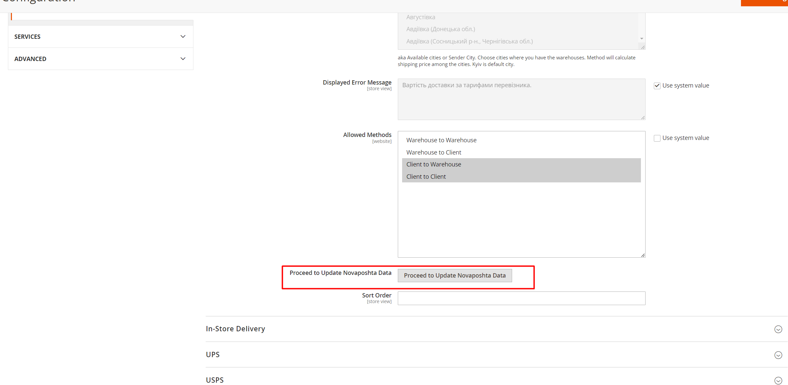  
Be sure cron jobs are enabled for Magento 2.  
Insert the API key and save the settings and enable the module.  
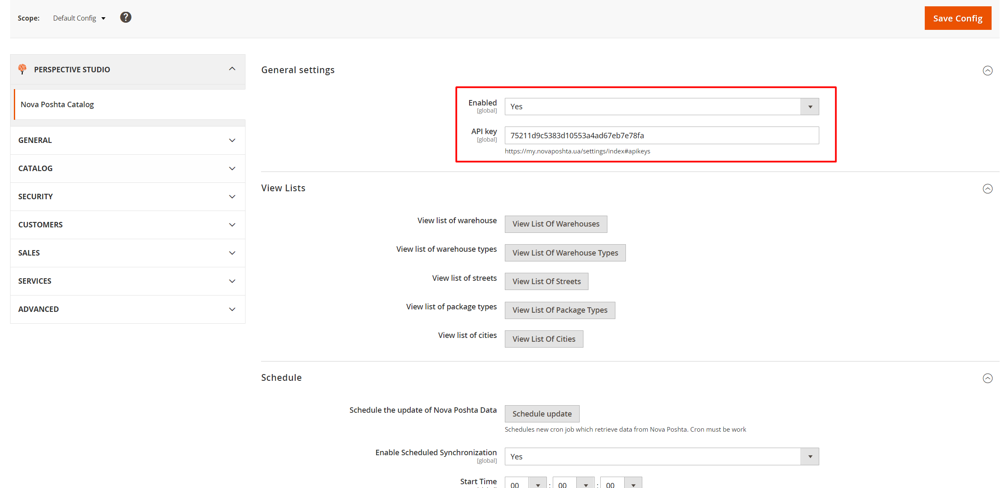  
Click the "Schedule update" button to update the catalog.  
#### Set up the module
1. To use the module, you need to register on the site https://novaposhta.ua/ and get the API key.
2. In the admin panel, in the module settings, enter the API key and the sender's data.
3. Adjust the Sender's Warehouse Cities  
   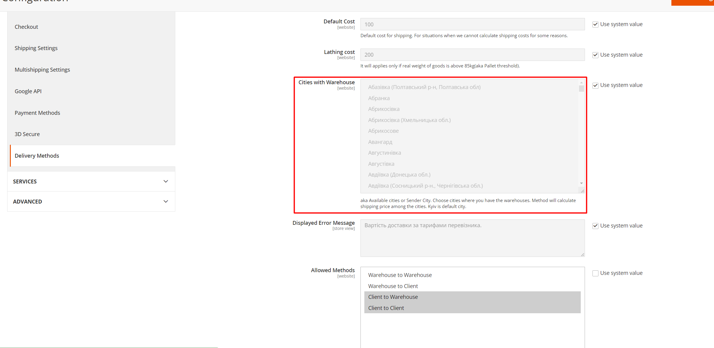  
   3.1. This module can calculate the shipping price for several warehouses.
4. Adjust "Is Organization" option for business or private sender  
   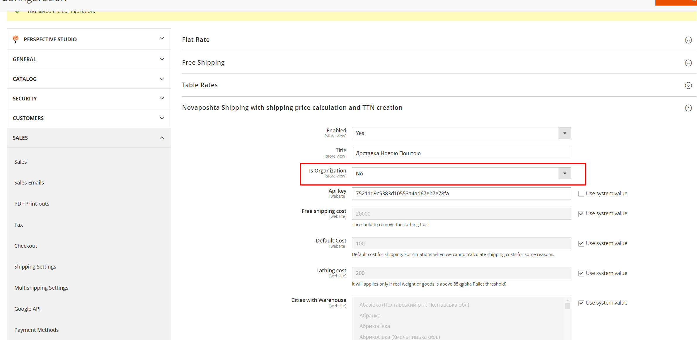
5. Choose appropriate "Delivery Technology"  
   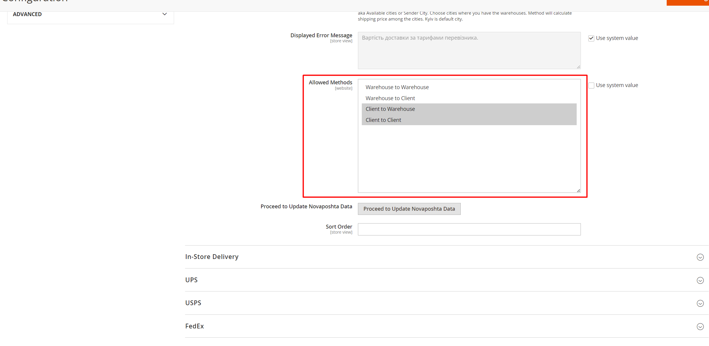

#### Check the module on frontend
1. Add dimensions and weight to the products in the admin panel.
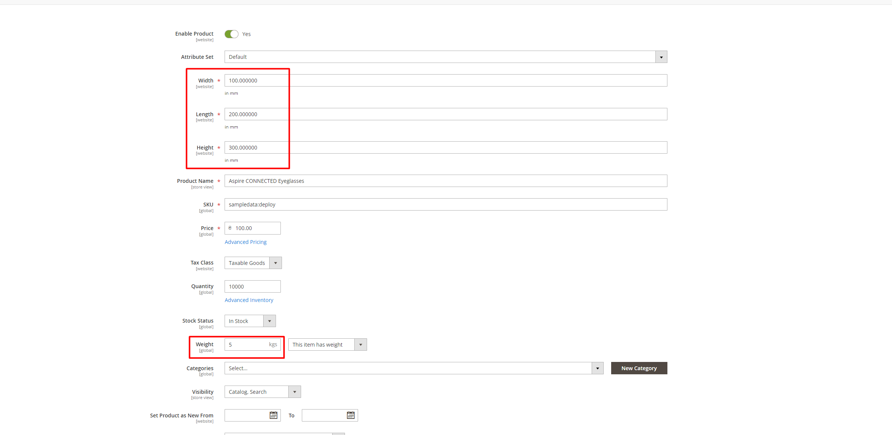
2. Add products to the cart and proceed to checkout.
3. Fill obligatory fields and choose shipping method.
4. Depends on the chosen delivery technology, you can see the shipping price and additional fields for persist data from customer. First part can be varied depends on your business processes(In example specified sender technology is "Client").    
4.1. If you choose "Client-Warehouse" delivery technology, you can see the shipping price and select the warehouse from the list of warehouses of the customer's city.  
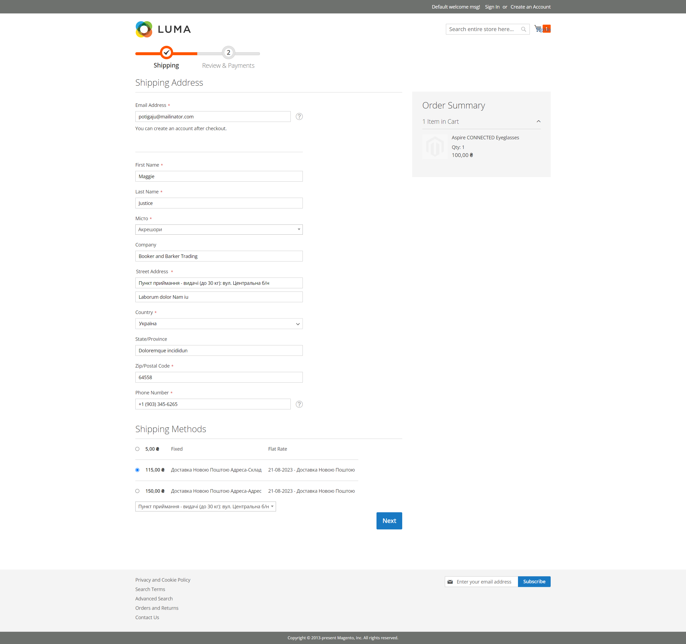  
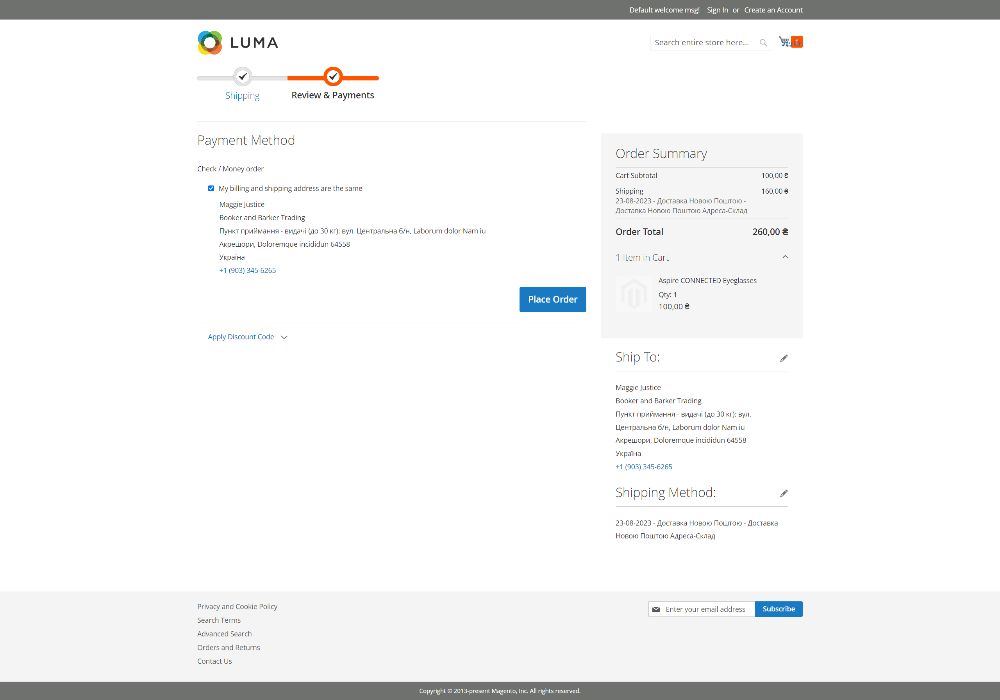  
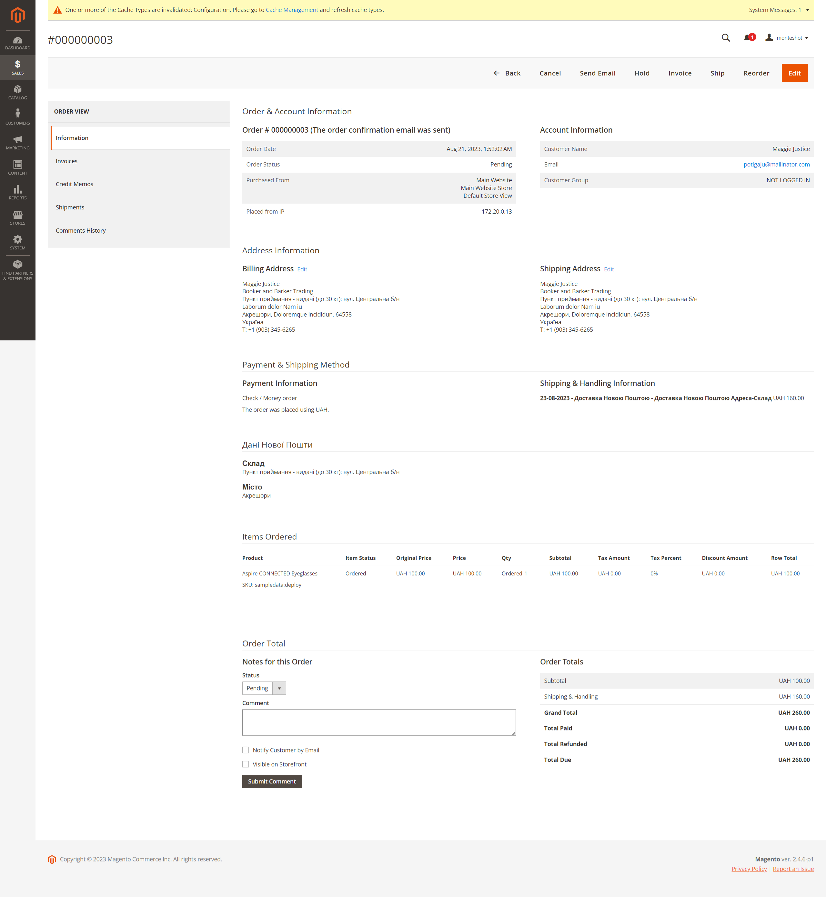   
4.2. If you choose "Client-Client" delivery technology, you can see the shipping price and select the address from the list of streets of the customer's city and house+apartment number.  
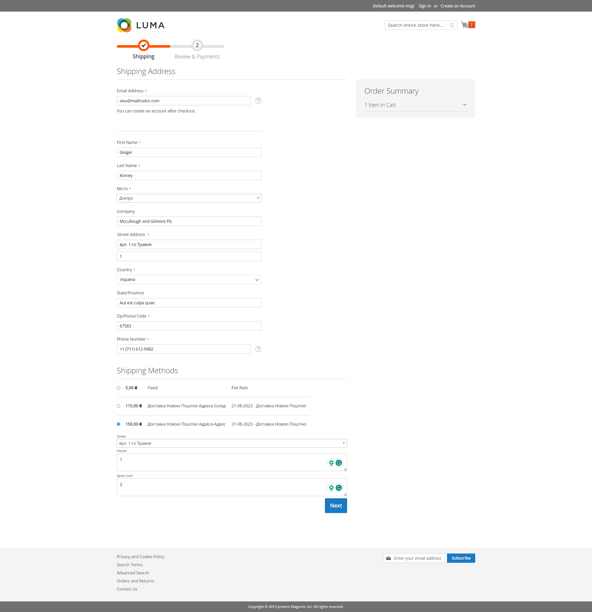  
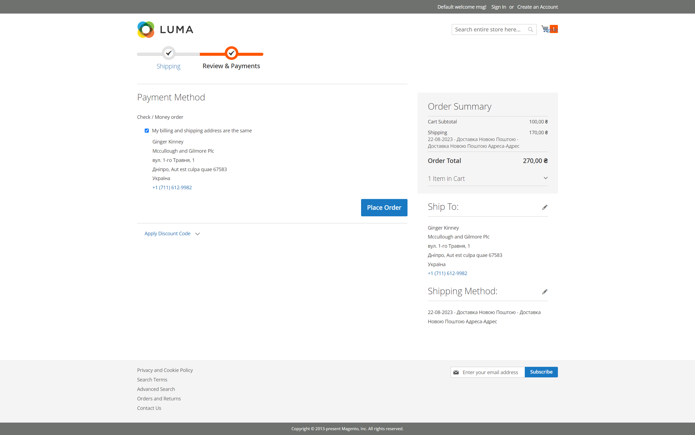  
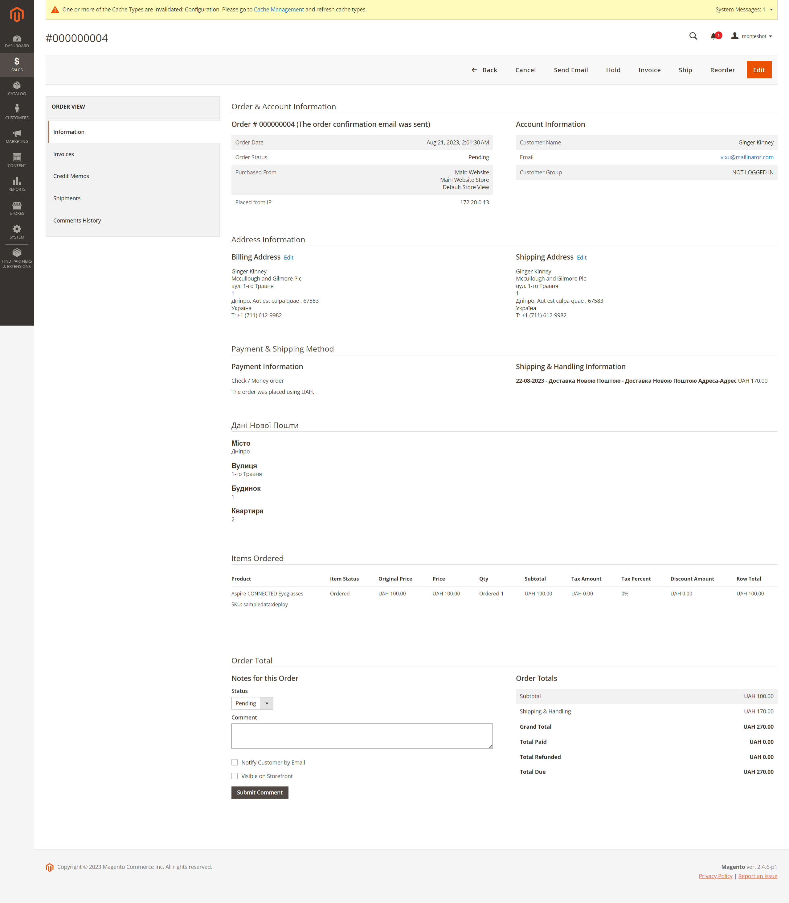  
5. Important notice about Luma checkout:  
Sometimes on shipping and payment step shipping price can vary. It is because the finalisation of calculation of shipping price finished only after transition to next step(payment step).  
You can debug this behaviour in cache table  
```perspective_novaposhta_shipping_sales_onestep_price_cache```    
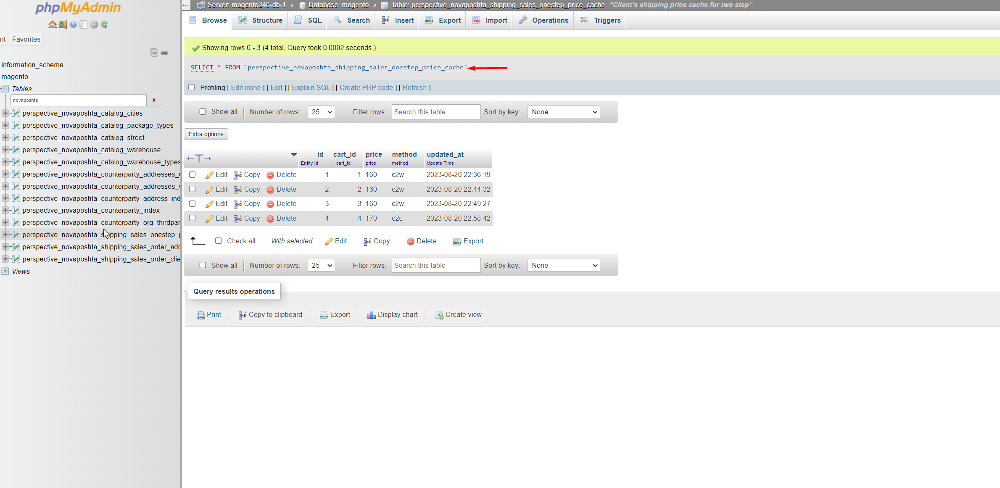
